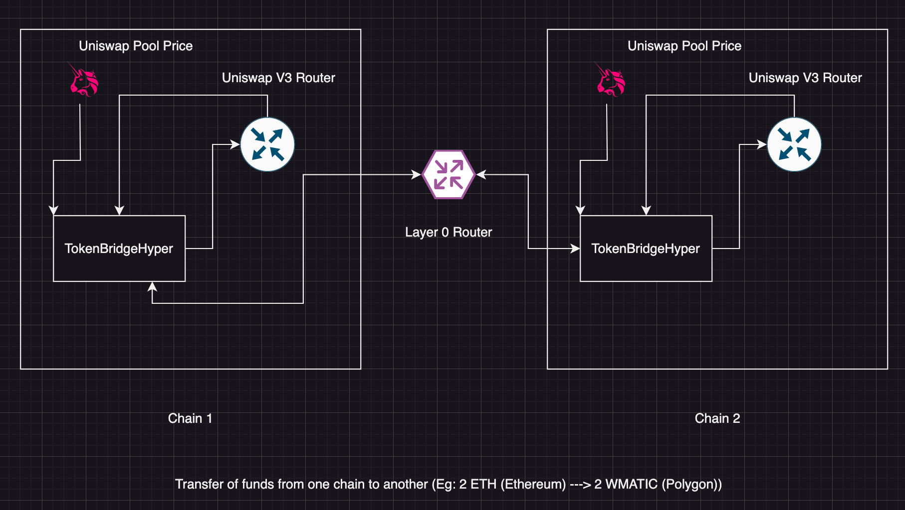

# Hyper Token Bridge

Hyper Token Bridge is a cross chain bridge that allows to swap native token to wrapped native on the other chain. For eg. I want to swap the native `BNB` token into `WMATIC` token on the polygon chain so hyper bridge can do that in a very less time.

## How it works ?

</img>

### Chain 1

- User initiates the `bridgeToken` function.
- Value of the transaction is checked.
- Upon receiving the asset then the message is sent to another chain using `_lzSend()`.

### Chain 2

- Upon receiving the message from the source chain `_nonblockingLzReceive` function is called.
- Now decoding of the bytes is done and the values are stored.
- After that `_performAssetSwapOnReceiving` function is initiated thus swapping the USDC present on the smart contract with the wrapped native and sending it to the recipient.

## Tech Used

- Layer Zero
- Uniswap V3 router
- Chainlink Price Feed
- Hardhat
- Solidity
- TypeScript
